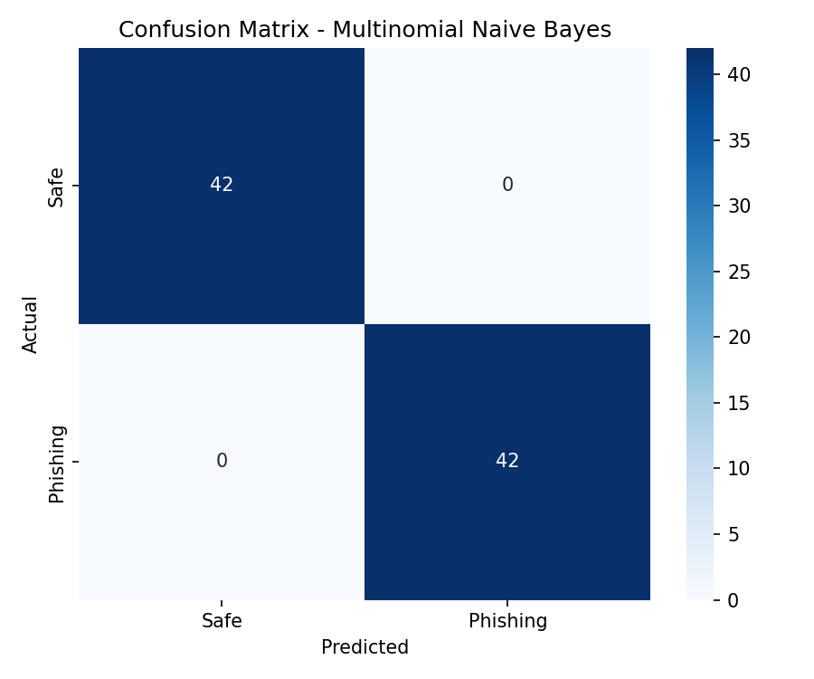

# Phishing Email Detection Model

Defensive cybersecurity + ML mini-project: classify an email as **Phishing (1)** or **Safe (0)** from its subject, body text, and static URL signals — using Scikit-learn. No links are ever opened, downloaded, or executed.

## Overview

Phishing emails use urgency ("act now"), credential theft ("verify your password"), and lookalike/malicious URLs to steal accounts and money. This project builds a reproducible text + URL-feature classifier with:

- Reusable preprocessing (`src/preprocessing.py`)
- Static URL feature extraction (`src/url_features.py`, never visits URLs)
- TF-IDF + numeric features (`src/feature_extraction.py`)
- 3 compared models, stratified split, best-F1 selection (`src/train.py`)
- CLI prediction (`src/predict.py`) + Streamlit UI (`app.py`)
- Tests with pytest (`tests/`)

> ML output is a **confidence score, not proof**. Expect false positives/negatives. Always verify sensitive requests via official channels.

## Features

- Subject + body combined analysis
- HTML stripping, lowercasing, URL/email placeholder tokens, whitespace normalisation
- TF-IDF (unigrams + bigrams, 5000 features, English stop words)
- 9 static URL features (counts, IP URLs, suspicious chars/TLDs, HTTPS, length, subdomains, redirects)
- Logistic Regression / Multinomial Naive Bayes / Random Forest comparison
- Accuracy, precision, recall, F1, classification report, confusion matrix (PNG)
- Joblib-saved pipeline reloadable without retraining
- CLI + Streamlit front end with confidence + URL-signal table
- Validation for missing data, bad labels, empty input, corrupt model

## Architecture

```text
Email (subject + body)
  ↓
Preprocessing (clean_text, combine_subject_body)
  ↓
Text + URL Feature Extraction (static only, no network)
  ↓
TF-IDF + Numerical Features (fitted on TRAIN only)
  ↓
Machine Learning Model (LR / NB / RF, best-F1 wins)
  ↓
Prediction
  ↓
Phishing / Safe
  ↓
Confidence + Analysis (probability + URL signals)
```

Data-leakage rule: `train_test_split` happens **before** `fit`. The `TfidfVectorizer` and `StandardScaler` are fitted only on `X_train` inside the pipeline. See `src/train.py` and `src/feature_extraction.py:TextAndUrlFeatures`.

## Technologies Used

- Python 3.11+
- Scikit-learn, Pandas, NumPy, SciPy
- Matplotlib, Seaborn (confusion matrix)
- Joblib (model persistence)
- Streamlit (optional UI)
- pytest (tests)

## Dataset

Expected CSV: `data/raw/emails.csv` with columns:

| column | meaning |
|---|---|
| `subject` | email subject (optional, defaults to `""`) |
| `email_text` | email body (`body` / `email_body` also accepted) |
| `label` | `1` = Phishing, `0` = Safe |

This repo ships a **synthetic sample dataset** (`420` rows, `210` phishing / `210` safe, balanced) generated from phishing templates (account suspension, lottery, invoice, crypto, delivery…) and safe templates (meetings, receipts, HR, newsletters…) plus harder overlap cases (URL-stripped phishing, multi-URL safe mail). It exists **only to test the pipeline end-to-end**.

> For meaningful evaluation, replace it with a real dataset (e.g. Nazario phishing corpus, Enron-Spam, SpamAssassin, CEAS-08, Kaggle phishing-email corpora). Re-run `python -m src.train` — no code changes needed as long as columns match.

Class distribution is printed at train time. Splitting is stratified; `LogisticRegression` and `RandomForest` use `class_weight="balanced"`. No blind oversampling.

## Machine Learning Approach

1. `clean_dataframe()` validates columns/labels, fills NaNs, drops fully-empty rows.
2. Stratified `train_test_split(test_size=0.2, random_state=42)`.
3. Pipelines (so vectorizer/scaler fit only on train):
   - NB: `TfidfVectorizer → MultinomialNB` (text-only; NB needs non-negative input).
   - LR: `TextAndUrlFeatures (TF-IDF + scaled URL feats) → LogisticRegression(class_weight=balanced)`.
   - RF: `TextAndUrlFeatures → RandomForest(n_estimators=200, class_weight=balanced)`.
4. Evaluate all three on the held-out test set; select highest **F1-score**.
5. Save `{"pipeline", "model_name", "metrics", "all_metrics"}` via Joblib to `models/phishing_email_model.pkl`; save confusion matrix PNG to `results/confusion_matrix.png`.

## Feature Engineering

Text (TF-IDF learns these automatically): urgency words (`urgent`, `immediately`, `24 hours`, `suspended`), credential/payment terms (`verify`, `password`, `login`, `bank`, `account`, `invoice`, `refund`), prize lures (`winner`, `lottery`, `claim`, `prize`, `free`), plus `urltoken` placeholder frequency and bigram patterns.

URL numeric features (`src/url_features.py`, regex + `urllib.parse` only):

| feature | description |
|---|---|
| `num_urls` | total URLs found |
| `num_unique_urls` | unique URLs |
| `num_ip_urls` | URLs with `http://1.2.3.4` literal-IP hosts |
| `num_suspicious_chars` | count of `@ - _ % & = ~ ? # $ ! +` inside URLs |
| `num_redirects` | `//` after protocol, `@` tricks, `redirect`-keyword + obfuscation hints |
| `has_https` | 1 if any URL uses HTTPS |
| `max_url_length` | longest URL length |
| `max_num_subdomains` | deepest subdomain chain (e.g. `a.b.c.evil.xyz` → 3) |
| `has_suspicious_tld` | 1 if domain ends in `.tk .ml .ga .cf .gq .xyz .top .click …` |

## Model Training

```bash
pip install -r requirements.txt
python -m src.train
python -m src.train --data data/raw/emails.csv --test-size 0.2
```

Output: class balance, per-model accuracy/precision/recall/F1 + TP/TN/FP/FN + classification report, comparison table, winning model name, `models/phishing_email_model.pkl`, `results/confusion_matrix.png`.

## Model Evaluation

Metrics use `sklearn.metrics` on the held-out test set (`84` emails, `42` per class):

- **Accuracy** — overall correctness.
- **Precision** — of flagged phishing, how many truly phishing. High precision = few false alarms. Important because false alarms erode trust.
- **Recall** — of real phishing, how many caught. High recall = few missed attacks. Important because a missed phish (FN) can mean account takeover.
- **F1** — harmonic mean of precision/recall; used for model selection.
- **Confusion matrix** — TP/TN/FP/FN breakdown + heatmap.

### Why precision and recall matter here

Missing a phish (low recall) is dangerous; crying wolf on legit mail (low precision) makes users ignore warnings. Phishing detectors are tuned for **high recall without collapsing precision** — hence F1-based selection and reporting both.

### Confusion matrix (winning model, test set)



How to read it: rows = actual, columns = predicted. Diagonal = correct (TN top-left, TP bottom-right). Off-diagonal = errors (FP top-right = safe flagged as phishing; FN bottom-left = phishing missed as safe). Current best model: `TP=42 TN=42 FP=0 FN=0` (see Results table below for all three models).

Definitions: **TP** = phishing correctly flagged. **TN** = safe correctly passed. **FP** = safe wrongly flagged. **FN** = phishing wrongly passed (most costly).

## Installation

```bash
git clone <your-repo-url>
cd phishing-email-detector
python -m venv .venv && source .venv/bin/activate  # Windows: .venv\Scripts\activate
pip install -r requirements.txt
```

## Usage

### Training

```bash
python -m src.train
```

### CLI Prediction

```bash
python -m src.predict
# Enter email subject: Your account has been suspended
# Enter email body: Click http://secure-verify-login.tk/auth immediately ...

# Non-interactive:
python -m src.predict --subject "Team meeting tomorrow" --body "Standup at 10am in room B."
```

### Streamlit Application

```bash
streamlit run app.py
```

UI: title, subject input, body text area, **Analyze Email** button, result (🔴 PHISHING / 🟢 SAFE), confidence metric, URL-signal table, disclaimer.

## Example Prediction

Phishing:

```text
================================
PHISHING EMAIL DETECTOR
================================
Subject: Your account has been suspended
Email: Click http://secure-verify-login.tk/auth immediately to verify your password or your account will be closed.

Prediction: PHISHING
Probability: 97.37%
(Model confidence, not a guarantee.)
```

Safe:

```text
Subject: Team meeting tomorrow
Email: Hi team, standup at 10am in room B. Thanks!

Prediction: SAFE
Probability: 93.51%
```

## Project Structure

```text
phishing-email-detector/
├── app.py                  # Streamlit UI
├── data/
│   ├── raw/emails.csv      # sample dataset (replace with real data for research)
│   └── processed/          # optional cleaned outputs
├── models/
│   └── phishing_email_model.pkl  # saved pipeline (regenerate via train)
├── notebooks/
│   └── exploration.ipynb   # EDA: balance, lengths, URL stats, top TF-IDF terms
├── results/
│   └── confusion_matrix.png
├── src/
│   ├── __init__.py
│   ├── preprocessing.py    # clean_text, combine_subject_body, clean_dataframe
│   ├── url_features.py     # static URL features + UrlFeatureExtractor
│   ├── feature_extraction.py  # TF-IDF + TextAndUrlFeatures pipelines
│   ├── train.py            # train/compare/select/save + metrics + plot
│   ├── evaluate.py         # metrics + confusion-matrix helpers
│   └── predict.py          # load model + CLI prediction
├── tests/
│   ├── test_preprocessing.py
│   ├── test_url_features.py
│   └── test_prediction.py
├── requirements.txt
├── README.md
├── .gitignore
└── LICENSE
```

Run tests: `python -m pytest tests/ -v`

## Results

Actual output from `python -m src.train` on the bundled 420-row sample (336 train / 84 test, stratified, `random_state=42`):

| Model | Accuracy | Precision | Recall | F1 Score |
|---|---|---|---|---|
| Logistic Regression | 0.9405 | 1.0000 | 0.8810 | 0.9367 |
| Multinomial Naive Bayes | 1.0000 | 1.0000 | 1.0000 | 1.0000 |
| Random Forest | 1.0000 | 1.0000 | 1.0000 | 1.0000 |

Winning model (highest F1): **Multinomial Naive Bayes** — saved to `models/phishing_email_model.pkl`.

Test-set confusion counts (winner): `TP=42 TN=42 FP=0 FN=0`. Logistic Regression missed 5 URL-stripped phishing mails (`FN=5`), illustrating why text signals matter when URL signals are absent.

> These numbers reflect the synthetic sample only. Swap in a real corpus before citing performance anywhere.

## Limitations

- Sample dataset is synthetic/template-based; real phish are more diverse and adversarial.
- English-only; TF-IDF bag-of-words misses paraphrase, homoglyphs, image-based phish.
- Static URL regexes miss shorteners, compromised legit domains, QR/attachment vectors.
- No header/auth analysis (SPF/DKIM/DMARC), no attachment sandboxing, no reputation lookups (by design — no network).
- Perfect scores above are an artefact of the sample; expect lower, messier results on real data.
- `random_state=42` fixes splits but not concept drift — retrain as phish evolve.

## Future Improvements

- Real-dataset training + cross-validation + calibration curves
- Character n-grams / subword embeddings, phishing-lexicon features, header features
- Language-agnostic models, adversarial/typosquat detection, URL-expansion *offline* allowlists
- Threshold tuning for recall-priority operating points, explainability (top contributing tokens)
- Monitoring, scheduled retraining, CI tests + linting

## Ethical / Security Considerations

Defensive, educational project only. Treat all email content as **untrusted input**: never execute attachments, open URLs, download resources, send mail, or contact suspicious domains — this codebase performs static string analysis exclusively. Predictions can be wrong in both directions; do not use as sole basis for blocking, punishment, or legal action. Handle real email corpora with privacy care (PII minimisation, consent, retention limits).
